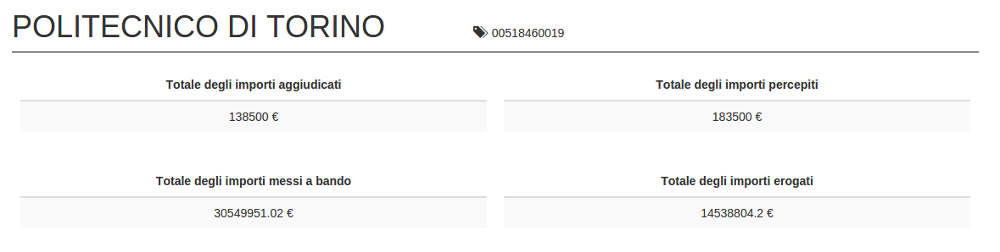
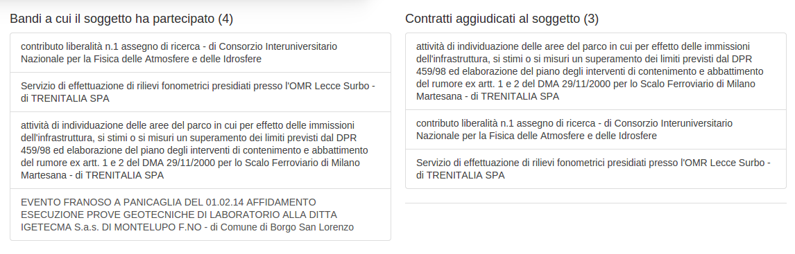
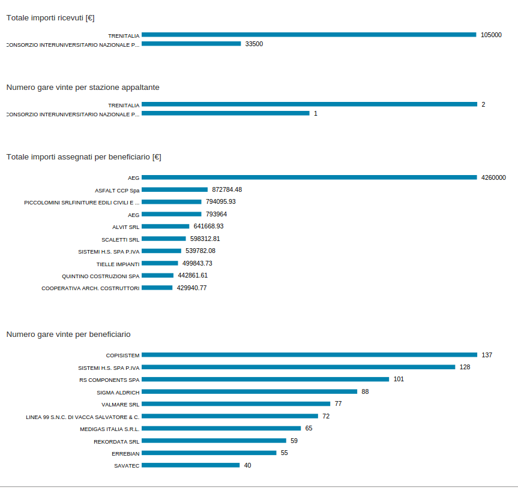

# vis-public-contracts
This project allows you to create visualizations from the RDF representation of Italian public contracts, in compliance with the Transparency Act, L.190/2012.

The RDF files can be generated using the rdf-public-contracts module available on [GitHub](https://github.com/giuseppefutia/rdf-public-contracts).

To run the visualization module you need to
* Install NodeJS (we have tested our tool with v0.10.0+);
* Go to the ```server``` directory and run ```node server.js```;
* Open a browser at ```http://localhost:3035```.

## Description

In this module we have created an interactive visualization to represent the Italian public contracts data. You can explore the following kind of visualizations.

A table to see total amounts.



A box to navigate contracts.



Bars charts to show rankings.



A bubble chart to see the dimension of the contracts.


